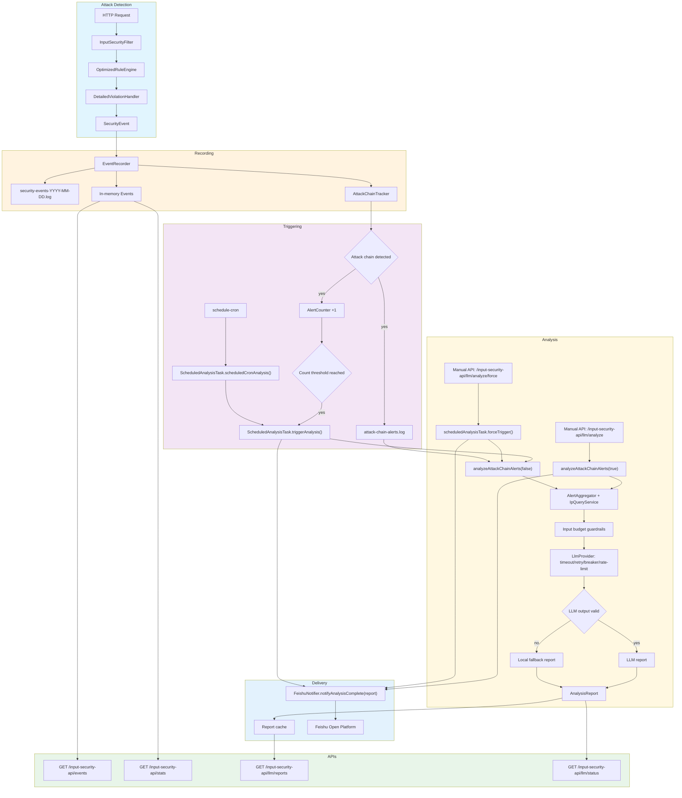

# 🛡️ Input Security Starter

[](LICENSE) [](https://spring.io/projects/spring-boot) [](https://www.java.com)[](CONTRIBUTING.md)

[English](README.md) | [中文](README_ZH.md)

**Zero-intrusion, production-grade, AI-powered Spring Boot web security component.**

Input Security Starter perfectly combines traditional **WAF rule engine** with modern **Cyber Kill Chain model** and **LLM intelligent analysis**, providing enterprise-grade defense-in-depth capabilities for your applications.


## ✨ Core Features

- 🔌 **Zero Code Intrusion**: Just add dependency - no annotations, no business logic changes required.

- ⛓️ **Attack Chain Tracking**: State machine-based model to precisely identify 6-phase attack paths from "Reconnaissance" to "Actions".

- 🧠 **LLM Intelligence**: Integrated with **Zhipu AI (GLM-4)** and **Alibaba Cloud Bailian (Qwen)** for automatic attack intent analysis, eliminating "alert fatigue".

- 🌍 **Threat Intelligence Enhancement**: Async integration with **AbuseIPDB** to automatically identify global malicious IPs, botnets, and Tor nodes.

- 📱 **Feishu Real-time Notification**: Integrated with **Feishu Open Platform**, automatically pushes interactive card messages to group chats or private chats after LLM analysis completes.

- 🚀 **Production-Grade Performance**: Async logging, memory circuit breaker protection, sliding window mechanism - zero business latency.

- 📊 **Full-Stack Observability**: Structured JSON logs provided, easily integrated with ELK, Splunk, or custom monitoring platforms.


## 🏗️ Architecture Overview

We use a **dual-trigger analysis mechanism**:
- attack-chain alert count reaches a threshold
- cron schedule is reached, then a report is generated automatically and pushed to Feishu after analysis



## 🚀 Quick Start

### 1. Add Dependency

Add the component to your `pom.xml`:

```xml
<dependency>
    <groupId>org.example</groupId>
    <artifactId>input-security-starter</artifactId>
    <version>1.0.0</version>
</dependency>
```

### 2. Configuration

The current demo application's defaults in [application.yml](/d:/Desktop/Input-Security-Starter-master/src/main/resources/application.yml) enable UI, LLM, auto-analysis, and Feishu. Adjust them for production as needed.

```yaml
input-security:
  enabled: true                    # Enable detection
  mode: monitor                    # monitor: log only, block: return 403
  
  # Path whitelist
  exclude-paths:                   # Paths to skip detection
    - /static/
    - /health
    - /actuator/
  include-paths: []                # Paths to detect (empty = all paths)
  
  # Logging
  log-file-path: security-events.log
  max-log-size-mb: 50              # Max single log file size
  max-log-files: 10                # Log file rotation count
  async-log-enabled: true          # Async logging for performance
  
  # Attack Chain Tracking (Cyber Kill Chain Model)
  attack-chain:
    enabled: true                  # Enable attack chain detection
    max-sessions: 10000           # Max concurrent sessions to track
    session-timeout-minutes: 30   # Session timeout
    max-events-per-session: 20    # Max events per session (sliding window)
    min-phases-for-chain: 3       # Minimum phases to form an attack chain
    alert-log-path: attack-chain-alerts.log  # Alert log file path
  
  # LLM Analysis
  llm:
    enabled: true                  # Enable LLM analysis
    provider: glm                  # LLM provider: glm or aliyun-bailian
    max-alerts-per-analysis: 50   # Max alerts per analysis
    analysis-timeout-ms: 90000    # Analysis timeout
    abuse-ip-db-api-key: ""       # AbuseIPDB API Key (get from https://www.abuseipdb.com/api)
    abuse-ip-db-max-age-days: 90  # Days to look back for IP reports
    ip-log-dir: "."               # Directory for IP log files
    
    # Advanced Configuration (shared by all providers)
    advanced:
      connect-timeout-ms: 30000
      read-timeout-ms: 300000
      max-retries: 2
      retry-base-delay-ms: 500
      retry-max-delay-ms: 8000
      circuit-failure-threshold: 5
      circuit-open-window-ms: 60000
      requests-per-minute: 60
    
    # Zhipu AI GLM Configuration
    glm:
      api-url: "https://open.bigmodel.cn/api/paas/v4/chat/completions"
      api-key: "${GLM_API_KEY:}"   # Get from https://open.bigmodel.cn/
      model: glm-4-flash           # Model: glm-4-flash, glm-4
    
    # Alibaba Cloud Bailian Configuration
    aliyun-bailian:
      api-url: "https://dashscope.aliyuncs.com/compatible-mode/v1/chat/completions"
      api-key: "${ALIYUN_BAILIAN_API_KEY:}"  # Get from https://dashscope.console.aliyun.com/
      model: qwen-plus             # Model: qwen-plus, qwen-turbo, qwen-max
    
    # Dual-Trigger Auto-Analysis
    auto-analysis:
      enabled: true               # Enable automatic analysis
      alert-threshold: 50         # Trigger when unprocessed alerts >= 50
      count-check-interval-ms: 60000 # Poll alert count every 60s
      schedule-cron: "0 0 2 * * ?"   # Generate report automatically at 2 AM daily
    
    # Feishu Real-time Notification
    feishu:
      enabled: true               # Enable Feishu notification
      webhook-url: "https://open.feishu.cn/open-apis/im/v1/messages"  # Feishu API URL
      app-id: ""                  # Feishu App ID (get from https://open.feishu.cn/)
      app-secret: ""              # Feishu App Secret
      receive-id-type: "chat_id"  # Receiver type: chat_id(group), user_id(private), email
      receive-id: ""              # Receiver ID (group ID or user ID)
  
  # Advanced
  filter-order: -100               # Filter execution order
  enable-ui: true                  # Enable web UI for testing
  trusted-proxies: []              # Trusted proxy IPs for X-Forwarded-For
```

## 🤖 LLM Provider Configuration

### Zhipu AI (GLM)

```yaml
input-security:
  llm:
    provider: glm
    glm:
      api-key: "${GLM_API_KEY:}"
      model: glm-4-flash
```

Get your API key from: https://open.bigmodel.cn/

### Alibaba Cloud Bailian

Alibaba Cloud Bailian is a model aggregation platform that supports multiple LLM providers including Qwen, GLM, Kimi, MiniMax, and more.

```yaml
input-security:
  llm:
    provider: aliyun-bailian
    aliyun-bailian:
      api-key: "${ALIYUN_BAILIAN_API_KEY:}"
      model: qwen-plus
```

Get your API key from: https://dashscope.console.aliyun.com/

### Environment Variables

```bash
# For Zhipu AI GLM
export LLM_PROVIDER=glm
export GLM_API_KEY=your-glm-api-key

# For Alibaba Cloud Bailian
export LLM_PROVIDER=aliyun-bailian
export ALIYUN_BAILIAN_API_KEY=your-aliyun-api-key
```

## 🛡️ Protection Matrix

We cover all **6 phases of Cyber Kill Chain** with 14+ built-in high-risk vulnerability detection rules.

| Attack Phase | Vulnerability Types | Protection Focus |
| :----------------------------- | :------------------------------------------------- | :----------------------- |
| **🔍 1. Reconnaissance** | SSRF, Path Traversal, LDAP Injection | Scanner probing, sensitive file access |
| **📦 2. Delivery** | SQLi, XSS, XXE, NoSQL Injection | Malicious payload injection |
| **💥 3. Exploitation** | Command Injection, Code Execution, Deserialization | Vulnerability trigger, code execution |
| **💾 4. Installation** | WebShell Upload, Backdoor | Backdoor implantation, persistence |
| **📡 5. Command & Control (C2)** | C2 Communication, DNS Tunneling | Reverse shell, botnet communication |
| **🏃 6. Actions** | Data Exfiltration, Ransomware | Data theft, ransomware encryption |


## 📄 License

For learning and communication purposes only.
