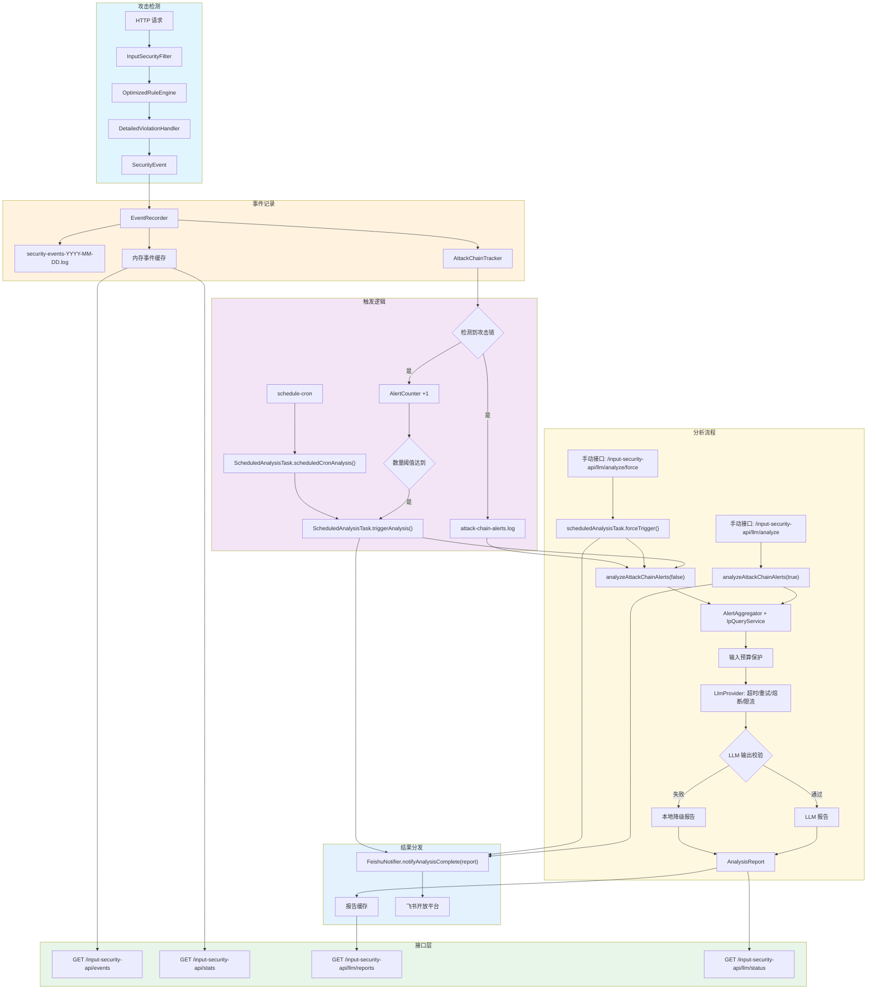

# 🛡️ Input Security Starter

[](LICENSE) [](https://spring.io/projects/spring-boot) [](https://www.java.com)[](CONTRIBUTING.md)

[English](README.md) | [中文](README_ZH.md)

**零侵入、生产级、AI 驱动的 Spring Boot Web 安全防护组件。**

Input Security Starter 将传统 **WAF 规则引擎**、**Cyber Kill Chain 攻击链追踪** 与 **LLM 智能分析** 结合在一起，为应用提供纵深输入安全防护能力。

## ✨ 核心特性

- 🔌 **零代码侵入**：引入依赖即可生效，无需改业务代码。

- ⛓️ **攻击链追踪**：按侦察、投递、利用、安装、命令控制、行动六个阶段跟踪攻击行为。

- 🤖 **LLM 智能研判**：支持**智谱 AI（GLM-4）** 和 **阿里云百炼（通义千问）** 对攻击链告警做自动分析与降级兜底。

- 🌍 **威胁情报增强**：可接入 AbuseIPDB，对攻击 IP 追加情报信息。

- 📨 **飞书通知**：分析报告生成后可自动推送飞书卡片消息。

- 🚀 **性能优先**：异步日志、内存滑动窗口、会话清理机制，降低对业务链路的影响。

- 📊 **可观测性**：提供结构化日志、事件查询、统计与报告查询接口。

## 🏗️ 架构概览

当前实现采用**双触发分析机制**：

- 攻击链告警累计达到阈值时自动触发分析
- 到达 `schedule-cron` 指定时间时自动生成报告，并在分析完成后推送到飞书



## 🚀 快速开始

### 1. 添加依赖

```xml
<dependency>
    <groupId>org.example</groupId>
    <artifactId>input-security-starter</artifactId>
    <version>1.0.0</version>
</dependency>
```

### 2. 配置示例

当前演示工程在 [application.yml](/d:/Desktop/Input-Security-Starter-master/src/main/resources/application.yml) 中默认开启了 UI、LLM、自动分析和飞书通知，生产环境请按需收敛。

```yaml
input-security:
  enabled: true
  mode: monitor

  exclude-paths:
    - /static/**
    - /health
    - /actuator/**

  log-file-path: security-events.log
  max-log-size-mb: 50
  max-log-files: 10
  async-log-enabled: true

  attack-chain:
    enabled: true
    max-sessions: 10000
    session-timeout-minutes: 30
    max-events-per-session: 20
    min-phases-for-chain: 3
    alert-log-path: attack-chain-alerts.log

  llm:
    enabled: true
    provider: glm                  # LLM 提供商: glm 或 aliyun-bailian
    max-alerts-per-analysis: 50
    analysis-timeout-ms: 90000
    abuse-ip-db-api-key: "${ABUSEIPDB_API_KEY:}"
    abuse-ip-db-max-age-days: 90
    ip-log-dir: "."
    
    # 公共高级配置（所有厂商共享）
    advanced:
      connect-timeout-ms: 30000
      read-timeout-ms: 300000
      max-retries: 2
      retry-base-delay-ms: 500
      retry-max-delay-ms: 8000
      circuit-failure-threshold: 5
      circuit-open-window-ms: 60000
      requests-per-minute: 60
    
    # 智谱 AI GLM 配置
    glm:
      api-url: "https://open.bigmodel.cn/api/paas/v4/chat/completions"
      api-key: "${GLM_API_KEY:}"
      model: glm-4-flash           # 可选: glm-4-flash, glm-4
    
    # 阿里云百炼配置
    aliyun-bailian:
      api-url: "https://dashscope.aliyuncs.com/compatible-mode/v1/chat/completions"
      api-key: "${ALIYUN_BAILIAN_API_KEY:}"
      model: qwen-plus             # 可选: qwen-plus, qwen-turbo, qwen-max, qwen-long

    auto-analysis:
      enabled: true
      alert-threshold: 50
      count-check-interval-ms: 60000
      schedule-cron: "0 0 2 * * ?"

    feishu:
      enabled: true
      webhook-url: "https://open.feishu.cn/open-apis/im/v1/messages"
      app-id: "${FEISHU_APP_ID:}"
      app-secret: "${FEISHU_APP_SECRET:}"
      receive-id-type: "${FEISHU_RECEIVE_ID_TYPE:chat_id}"
      receive-id: "${FEISHU_RECEIVE_ID:}"

  filter-order: -100
  enable-ui: true
  trusted-proxies: []
```

## 🤖 LLM 提供商配置

### 智谱 AI (GLM)

```yaml
input-security:
  llm:
    provider: glm
    glm:
      api-key: "${GLM_API_KEY:}"
      model: glm-4-flash
```

获取 API Key：https://open.bigmodel.cn/

### 阿里云百炼

阿里云百炼是一个模型聚合平台，支持多种大语言模型，包括通义千问、GLM、Kimi、MiniMax 等。

```yaml
input-security:
  llm:
    provider: aliyun-bailian
    aliyun-bailian:
      api-key: "${ALIYUN_BAILIAN_API_KEY:}"
      model: qwen-plus
```

获取 API Key：https://dashscope.console.aliyun.com/

### 环境变量配置

```bash
# 使用智谱 AI GLM
export LLM_PROVIDER=glm
export GLM_API_KEY=your-glm-api-key

# 使用阿里云百炼
export LLM_PROVIDER=aliyun-bailian
export ALIYUN_BAILIAN_API_KEY=your-aliyun-api-key
```

## 🛡️ 防护矩阵

项目内置规则覆盖 Cyber Kill Chain 六个阶段的主要高风险输入攻击：

| 攻击阶段 | 涉及风险 | 防护重点 |
| :-- | :-- | :-- |
| 1. 侦察 | SSRF、路径遍历、LDAP 注入 | 敏感资源探测与扫描行为 |
| 2. 投递 | SQL 注入、XSS、XXE、NoSQL 注入 | 恶意载荷注入 |
| 3. 利用 | 命令注入、代码执行、反序列化 | 漏洞触发与执行 |
| 4. 安装 | WebShell、后门植入 | 持久化与落地行为 |
| 5. 命令控制 | C2 通信、隧道通信 | 外联控制与反连 |
| 6. 行动 | 数据窃取、破坏、勒索 | 最终攻击目标执行 |

## 📄 许可证

本项目仅供学习交流使用。
